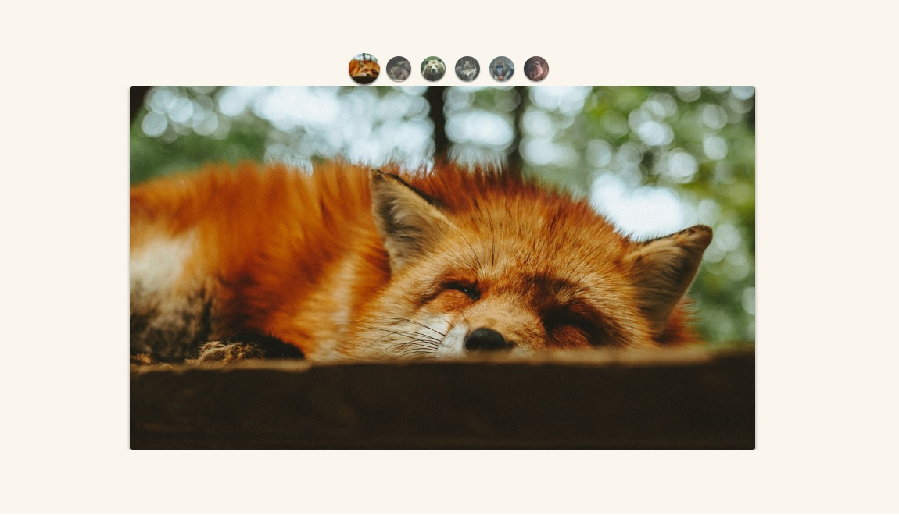

<h2>Hello ❕</h2>
<h3>➡️This project was developed using <strong>JavaScript</strong> 🛠️</h3>

➡️Developed during Origamid JS classes.

You can see it working <a href="https://joaodosantoscdev.github.io/animais-fantasticos/animais-fantasticos/" target="_blank" alt="animais-fantasticos">here</a>.

<h3>Desktop 🖥️</h3>
</img>

<h3>Mobile 📱</h3>

</img>

<h3>Overview ⮯</h3>

 There was applied here my knownledges JavaScript with DOM manipulation, creating effects and a better visual experience for the final user.

The path of the project was to clearly apply the most used and up-to-date concepts used in this language, without any kind of framework, creating a plugin that can be custumized by any WEB developer, and merged into his projects in a form of contribuition, the code behind this, is made in pure JavaScript with ECMA6+. ✔️

The CSS classes that are used and also the code can be tottaly changed for your needs, you can slow-down the animation, change the type of buttons, to arrows, and also do a top navigation menu with images as the example above shows.

<em>'This project has no commercial purposes, it was carried out only for the application of my studies'📚</em>

<strong>----João Vítor Carvalho 👨‍💻 ---</strong>
